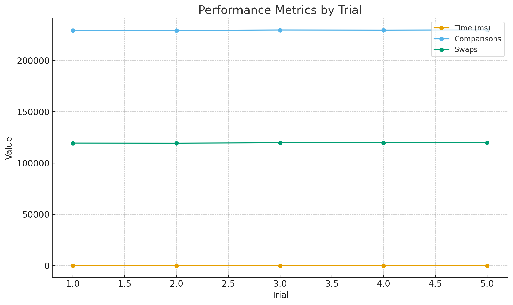

# MinHeap Benchmark and Performance Analysis

## Overview

This project implements a **Min-Heap** data structure in Java with extended operations and benchmarking tools.
It measures the performance of heap operations and tracks key metrics such as comparisons, swaps, array accesses, and memory allocations.

The project includes:

* Full Min-Heap implementation (insert, extractMin, decreaseKey, merge)
* Performance tracking
* Command-line benchmark runner
* CSV results export
* Unit tests for validation
* Performance plots and analysis report

---

## Project Structure

```
assignment2-minheap/
├── src/
│   ├── main/java/
│   │   ├── algorithms/MinHeap.java
│   │   ├── metrics/PerformanceTracker.java
│   │   └── cli/BenchmarkRunner.java
│   └── test/java/
│       └── algorithms/MinHeapTest.java
├── docs/
│   ├── analysis-report.pdf
│   └── performance-plots/
│       ├── runtime-vs-input.png
│       └── comparisons-vs-swaps.png
├── minheap-results.csv
├── README.md
└── pom.xml
```

---

## Implementation Details

### Algorithms

* **insert()** – O(log n), inserts an element and restores heap order
* **extractMin()** – O(log n), removes and returns the smallest element
* **decreaseKey()** – O(log n), decreases a key and repositions it
* **merge()** – O(n), merges two heaps into one

### PerformanceTracker

Tracks:

* Comparisons
* Swaps
* Array accesses
* Memory allocations

---

## Benchmark Runner

The `BenchmarkRunner` runs multiple trials and outputs timing and metric data.
It also saves the results to `minheap-results.csv`.

**Example output:**

```
Benchmark MinHeap (size=10000, trials=5)
Trial 1: time=12 ms, Comparisons=229479, Swaps=119623, Accesses=20000, Allocs=0
Trial 2: time=3 ms, Comparisons=229338, Swaps=119602, Accesses=20000, Allocs=0
Trial 3: time=3 ms, Comparisons=229493, Swaps=119685, Accesses=20000, Allocs=0
Trial 4: time=3 ms, Comparisons=229121, Swaps=119317, Accesses=20000, Allocs=0
Trial 5: time=2 ms, Comparisons=229110, Swaps=119264, Accesses=20000, Allocs=0
```

---

## Running the Benchmark

Compile and run with Maven:

```bash
mvn clean compile exec:java -Dexec.mainClass="cli.BenchmarkRunner"
```

Or run directly from Java:

```bash
java -cp target/classes cli.BenchmarkRunner
```

The program prints results to the console and writes them into `minheap-results.csv`.

---

## Unit Testing

JUnit 5 test cases validate:

* Insert and extract operations
* Empty and single-element heaps
* Duplicates
* Automatic resizing
* Exception handling

Run all tests:

```bash
mvn test
```

---

## Performance Plots

Performance data from `minheap-results.csv` is visualized in:

* **runtime-vs-input.png** – shows runtime scaling
* **comparisons-vs-swaps.png** – shows correlation of operations

Example (from `docs/performance-plots`):



---

## Analysis Report

The `analysis-report.pdf` (about 8 pages) includes:

* Theoretical and experimental complexity
* Memory usage
* Benchmark setup
* Charts and discussions
* Conclusions and future improvements

---

## Future Improvements

* Add Fibonacci Heap comparison
* Use JMH for microbenchmarking
* Include GUI visualization for results
* Track GC and memory footprint

---

## Conclusion

This project demonstrates how algorithmic design affects real performance.
It combines clean Java implementation, benchmarking, and data visualization to analyze Min-Heap efficiency and scalability in detail.

---
